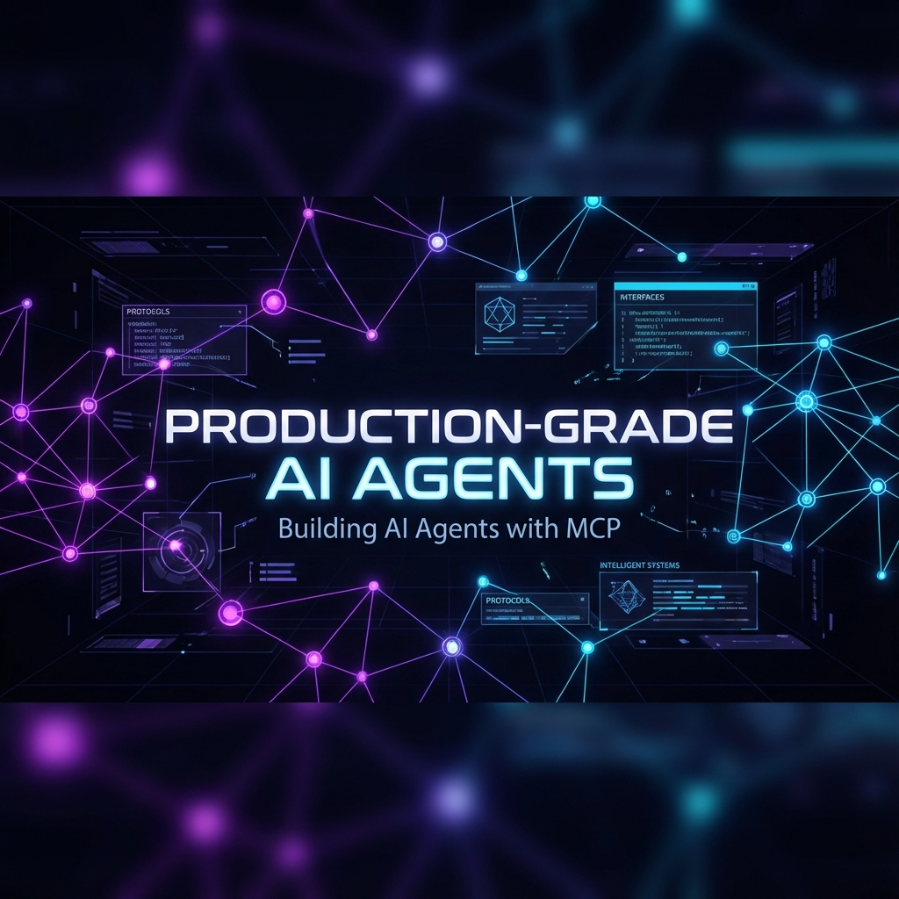
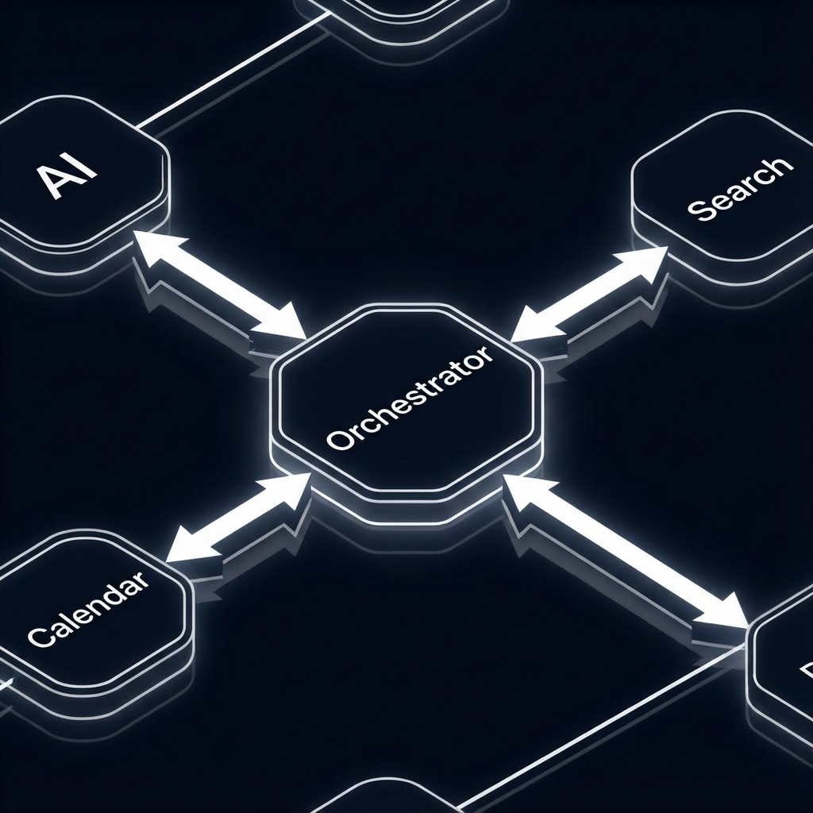
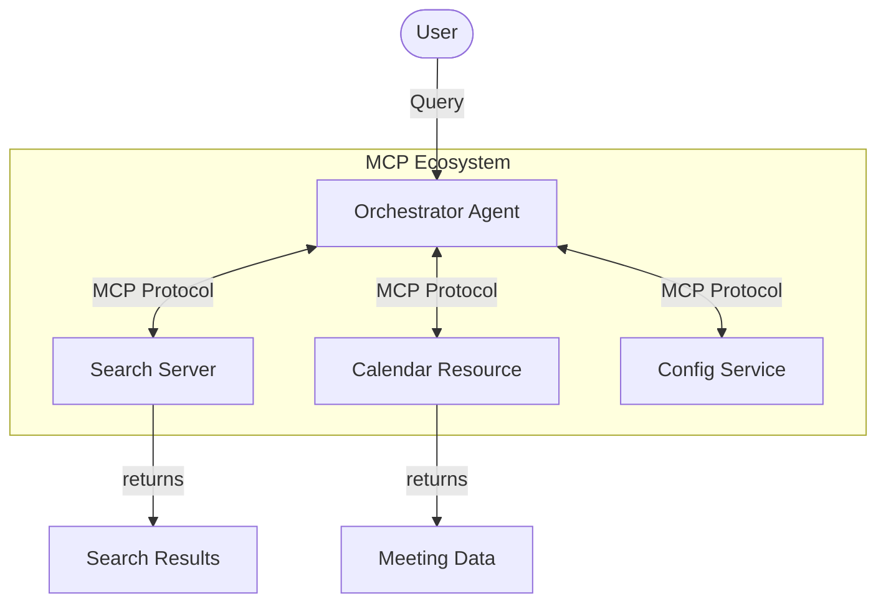

# Production-Grade MCP Agents: Proof of Concept



> **"From Chaos to Contract: Building Reliable AI Systems with the Model Context Protocol"**

This repository contains the reference implementation for the article "Building Production-Grade AI Agents with MCP & A2A". It demonstrates a robust, standardized architecture for Agent-to-Agent (A2A) communication using the Model Context Protocol (MCP).

## 🎯 Project Overview

This Proof of Concept (PoC) implements a **"Daily Minutes Assistant"**—a production-patterned system where an orchestration agent intelligently coordinates with specialized sub-services (Search, Calendar, etc.) via strict protocols rather than fragile prompts.

The core philosophy demonstrated here is: **Context Engineering > Prompt Engineering.**

## 🏗️ Architecture Design

The system relies on a hub-and-spoke model where the standard MCP protocol facilitates dynamic tool discovery and resource access.





## ✨ Key Features

- **FastMCP Implementation**: Rapid server development using `mcp.server.fastmcp`.
- **Typed Tool Contracts**: Automatic JSON-schema generation from Python type hints.
- **Resource Exposure**: Static and dynamic context serving via `config://` URIs.
- **Stdio Transport**: Zero-latency, secure local communication channels.
- **Production Directory Structure**: Clean separation of server, client, and testing logic.

## 🚀 Quick Start

### Prerequisites
- Python 3.10+
- `pip` (Python Package Installer)

### Installation

1. **Clone the Repository**
   ```bash
   git clone https://github.com/aniket-work/production-grade-mcp-agents.git
   cd production-grade-mcp-agents
   ```

2. **Install Dependencies**
   ```bash
   pip install -r requirements.txt
   ```

### Running the Agent

This PoC includes a self-contained client that handles the server lifecycle automatically.

```bash
python src/client/agent_client.py
```

**Expected Output:**
```text
Connected to server. Found 2 tools.
Executing search_web tool...
Result: Mock search results for 'MCP adoption trends'...
Reading resource config://app_settings...
```

## 📂 Project Structure

```
├── src/
│   ├── server/
│   │   └── agent_server.py    # The 'Tools' & 'Resources' Provider
│   └── client/
│       └── agent_client.py    # The 'Brain' / Consumer
├── title_card.png             # Project Asset
├── architecture.png           # Architecture Design
├── requirements.txt           # Dependency Spec
└── README.md                  # Documentation
```

## 🤝 Contributing

This is an experimental educational project. Feel free to fork and experiment with connecting real APIs (Tavily, Google Calendar, etc.) to the defined MCP endpoints.

## 📜 License

MIT License. See [LICENSE](LICENSE) for details.

---
*Created by Aniket*
